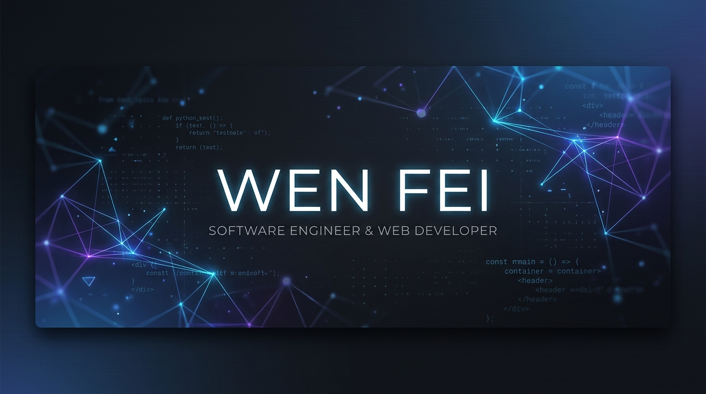

# Hi there! I'm Wen Fei 👋

  

  
  
  
  

---

### 💫 About Me

I am a passionate **Software Engineer & Web Developer** from Malaysia, specializing in Web Development, Frontend, Backend/Infrastructure, DevOps, and Cloud Security. Currently, I am actively focusing on **joining more Hackathons** and building robust, scalable applications!

* 🔭 **Current Focus:** Joining more hackathons and building exciting web apps.
* 🌱 **Learning Journey:** Master class on React.js, Tailwind CSS, Node.js, Next.js, and advanced cloud native architecture.
* 👨‍💻 **Portfolio:** Check out my work at [swenfei.vercel.app](https://wenfei.vercel.app/).
* 📄 **Resume:** Read about my experiences [here](https://drive.google.com/file/d/1O87LXO2ESETJbgxpY4F3SWVlBBKqxox9/view).
* ⚡ **Fun Fact:** I am extremely lazy—which makes me look for the most efficient, automated ways to solve problems. 😉

---

### 🛠️ Languages and Tools

<table>
  <tr>
    <td valign="top" width="50%">
      <h4>💻 Core Languages</h4>
      
      
      
      
      
      
      
      
      
    </td>
    <td valign="top" width="50%">
      <h4>🚀 Frameworks</h4>
      
      
      
      
      
      
      
      
      
    </td>
  </tr>
  <tr>
    <td valign="top" width="50%">
      <h4>⚙️ Backend & Infrastructure</h4>
      
      
      
      
      
      
      
      
      
      
      
      
    </td>
    <td valign="top" width="50%">
      <h4>🗄️ Database & Storage</h4>
      
      
      
      
      
      
    </td>
  </tr>
  <tr>
    <td valign="top" width="50%">
      <h4>🐳 DevOps & Deployment</h4>
      
      
      
      
      
      
      
      
    </td>
    <td valign="top" width="50%">
      <h4>🛡️ Cloud Security & SRE</h4>
      
      
      
      
      
      
    </td>
  </tr>
  <tr>
    <td valign="top" width="50%">
      <h4>🔧 Development Tools</h4>
      
      
      
      
      
    </td>
    <td valign="top" width="50%">
      <h4>🌍 Environments</h4>
      
      
      
    </td>
  </tr>
  <tr>
    <td valign="top" width="50%">
      <h4>🗣️ Languages</h4>
      
      
      
      
    </td>
    <td valign="top" width="50%">
      <h4>👥 Soft Skills</h4>
      
      
      
      
      
    </td>
  </tr>
</table>

---

### 📊 GitHub Stats

  
  

  

---

  <i>"Progress is made by lazy men looking for easier ways to do things." — Robert A. Heinlein</i>

